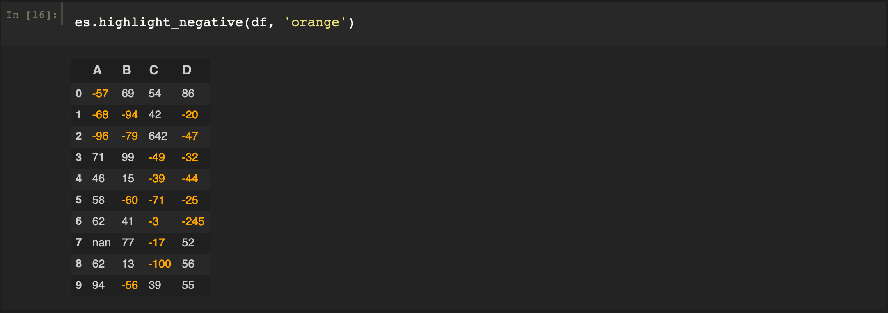
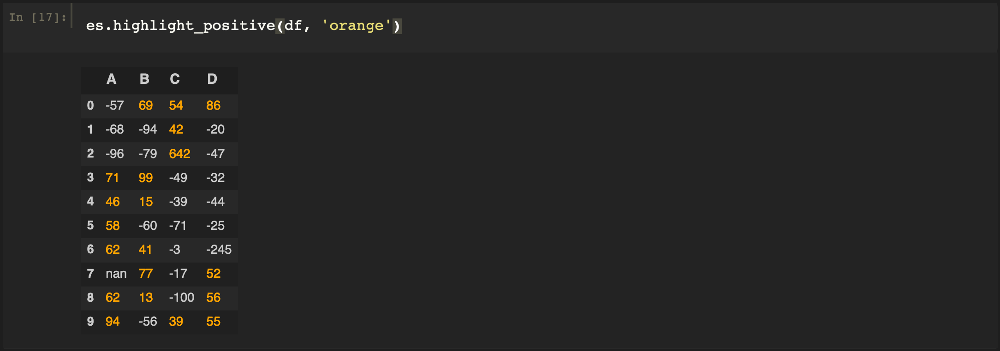
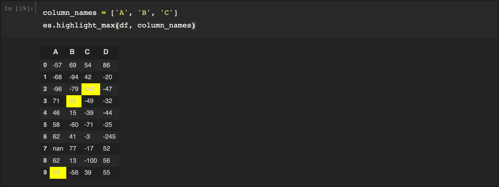
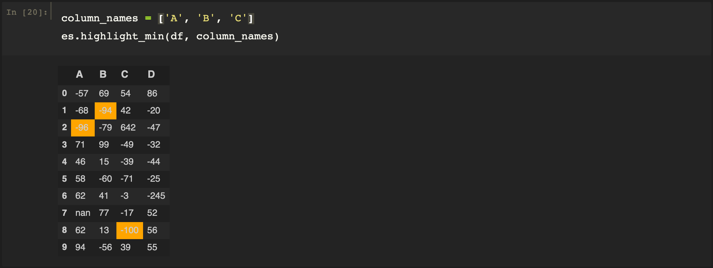
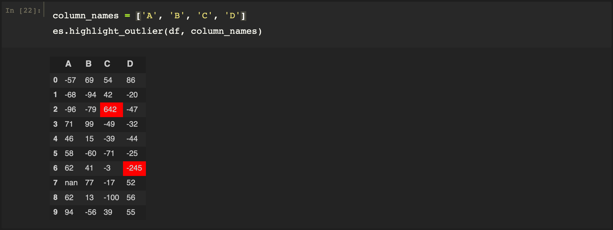
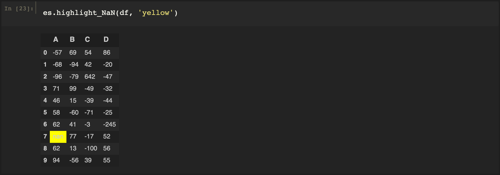
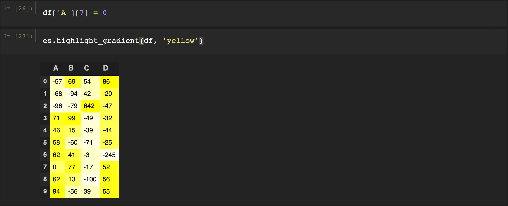

# easystyle

easystyle is a python package created to allow simple and quick data analysis without having to export to excel. easystyle reads in the data as a dataframe as highlights certain cells depending on what the user calls. The package is heavily dependent on the styling in pandas and pulls some basic code from the Stying pandas documentation. Functions such as identifying, by highlighting the cell or text, the maximum, the minimum, outliers, and NaN values are used in easystyle. These functions allow the user to take a quick look at their data in Jupyter Notebook. It also serves the purpose of showing the data cleaner than with a standard dataframe so that you can present the information to others without having to go to excel.

easystyle works great in Jupyter Notebook, but I am unsure of how well, or if it will work at all, in other environments

## Installing easystyle

    pip install easystyle

## Importing easystyle

The best way to import easystyle is:

    from easystyle import Style as es

This is since it makes it simpler to call functions when using the package. For the following examples we will assume this importing method.

## Creating an Example DataFrame

We create a DataFrame to be used in the examples. We edit some cells to contain outliers as well as NaN values:

    import numpy as np
    import pandas as pd
    df = pd.DataFrame(np.random.randint(-100,100,size=(10, 4)), columns=list('ABCD'))
    df['A'][7] = float('NaN')
    df['C'][2] = 642
    df['D'][6] = -245

## Highlight Negative Values

    def highlight_negative(df, col = 'red'):

In order to use highlight_negative, the user must provide the dataframe. The user does not need to provide a color, but may do so if they want a color other than red. To run the function:
    

## Highlight Positive Values

    def highlight_positive(df, col = 'green'):

This function follows similarly to the function above. To run the function:

## Highlight Negative and Positive Values

    def highlight_neg_pos(df, colNeg = 'red', colPos = 'green'):

Follows from above. To run the function:

## Highlight Maximum Value

    def highlight_max(df, column_names, col='yellow'):

The function is fed an additional variable, the column names. `column_names` is an array of the column names that you wish to find the maximum in. For example:

## Highlight Minimum Value

    def highlight_min(df, column_names, col='orange'):

Follows similarly to highlighting a maximum value. For example:

## Highlight Outliers

    def highlight_outlier(df, column_names, colLow='red', colUp='red'):

This function uses the IQR method in order to find outliers. Again, `column_names` is a array of column names. For example:

## Highlight NaN Values

    def highlight_NaN(df, color = 'red'):

If any NaN values are detected, they are highlighted. For example:

## Give a Gradient

    def highlight_gradient(df, color = 'green'):

This function uses the gradients provided by the Seaborn package. For example:

